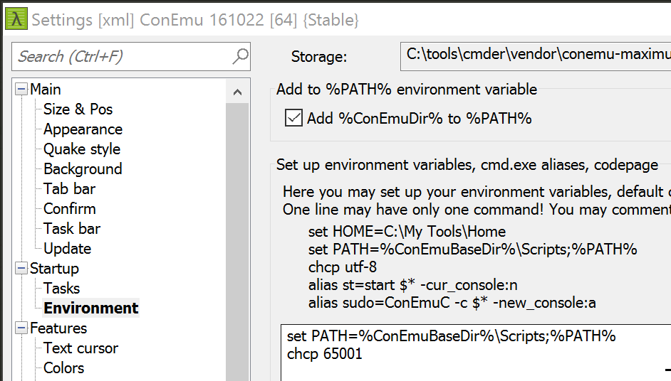

# Machine de développement sous Windows

Pour bien développer sous Windows, il est fortement recommandé d'avoir des outils de base listés ci-dessous.

## Package manager

### Chocolatey

Bien qu'historiquement Windows n'ait pas eu de façon unifiée d'installer des logiciels (à l'instar de Linux ou macOS),
il en est autrement aujourd'hui.

Merci à [Chocolatey](https://chocolatey.org/)!

**Installez-le!**

Ensuite, pour intaller un logiciel, il suffit de taper ceci depuis une ligne de commande: (plus de `suivant` ⇨ `suivant`)

```bash
choco install <nom_du_logiciel>
```

### npm

Un autre package manager très répandu est npm de Node.js

Pour l'installer:

```bash
choco install nodejs
```

## Shell

L'invité de commande standard de Windows est une injure à l'informatique du 21è siècle.

Installez [cmder](http://cmder.net)

```bash
choco install cmder
```

### Définir le codepage en UTF-8

Allez dans le menu sous `Settings...`, puis dans `Startup/Environment` ajouter la ligne suivante dans la zone de texte à droite:

```bash
chcp 65001
```

Voici une copie d'écran qui illustre ceci: 
