# Guide de style et d'ergonomie

Ce document décrit l'apparence et la fonctionnalité voulues des divers composants utilisés dans les applications web développées au CPNV.

Il s'agit d'un guide et non d'un règlement, ce qui veut dire que les développeurs l'appliqueront dans la grande majorité des cas, mais que des exceptions dûment justifiées peuvent être acceptées.

## Police de caractère
La police de caractère commune est Arial

<h1>Titre majeur (h1)</h1>
Introduction de section majeure: Lorem ipsum dolor sit amet, consectetur adipiscing elit, sed do eiusmod tempor incididunt ut labore et dolore magna aliqua. Ut enim ad minim veniam, quis nostrud exercitation ullamco laboris nisi ut aliquip ex ea commodo consequat. Duis aute irure dolor in reprehenderit in voluptate velit esse cillum dolore eu fugiat nulla pariatur
<h2>Titre mineur (h2)</h2>
Introduction de section mineure: Lorem ipsum dolor sit amet, consectetur adipiscing elit, sed do eiusmod tempor incididunt ut labore et dolore magna aliqua. Ut enim ad minim veniam, quis nostrud exercitation ullamco laboris nisi ut aliquip ex ea commodo consequat. Duis aute irure dolor in reprehenderit in voluptate velit esse cillum dolore eu fugiat nulla pariatur
<h3>Titre détails (h3)</h3>
Lorem ipsum dolor sit amet, consectetur adipiscing elit, sed do eiusmod tempor incididunt ut labore et dolore magna aliqua. Ut enim ad minim veniam, quis nostrud exercitation ullamco laboris nisi ut aliquip ex ea commodo consequat. Duis aute irure dolor in reprehenderit in voluptate velit esse cillum dolore eu fugiat nulla pariatur

## Couleurs

## Tables

Larasta travaille sur des données parfois nombreuses, mais rarement en très grande quantité. De ce fait les présentations sous forme de liste se font en deux modes:

1. Aéré: padding des cellules de 0.75em de tous les côtés, pagination à partir de 50 éléments

  Exemple: 
  
  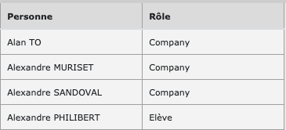

2. Dense: padding des cellules de 0.5em à droite et à gauche, aucune pagination

  Exemple: 
  
  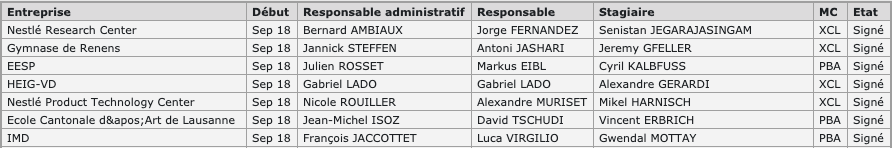

D'une manière générale, les vues tabulaires permettent d'accéder au détail d'un élément spécifique en cliquant sur la ligne. Cette fonctionnalité est suggérée grâce à la mise en évidence de la ligne lors du survol par la souris:

  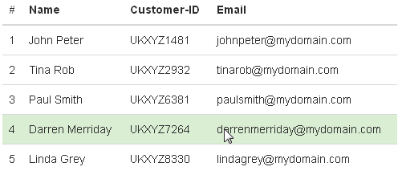

## Filtres

Lorsqu'une table peut être filtrée, cela est indiqué par un icône 'filter' à côté de la ligne d'en-tête:
  
Lorsqu'on clique sur le filtre, une ligne apparaît, qui permet de saisir les critères de filtre
  

Si une colonne contient une valeur énumérée, l'utilisateur peut en choisir une ou plusieurs valeurs dans une liste déroulante:
  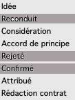

Les valeurs d'un filtre sont permanentes: si l'utilisateur quitte la page et y revient, le filtre est automatiquement affiché et appliqué. Ceci jusqu'à ce que le filtre soit supprimé (icône 'delete')

## Icônes

Les icônes utilisées sont toutes tirées de [fontawesome](https://fontawesome.com/icons?d=gallery&m=free)

## Formulaires

Styles [Bootstrap](https://getbootstrap.com/docs/4.0/components/forms/)

### Champs texte
Normal

  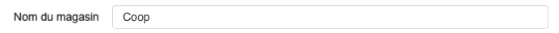

Désactivé

  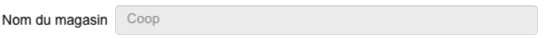

Edition

  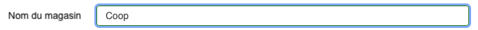

Erreur

  

### Listes déroulantes

  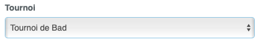

### Checkbox

  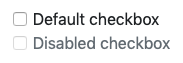

### Radiobutton

  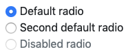

### Dates

Pour les dates, nous nous en remettons au type de champ 'date' de html 5.

Attention: il faut savoir que Internet Explorer 11 (et moins), ainsi que Safari sur Mac ne supportent pas ce type de champ

### Upload de fichier

Le chargement de fichier se fait au moyen du plugin javascript [Dropzone](https://www.dropzonejs.com)

### Boutons

Bootstrap propose des couleurs de boutons. Nous les utilisons de la manière suivante:

   pour une action de création
  
   pour une action de suppression
  
   pour une action de modification
  
  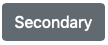 pour 'Annuler'
  
### Erreurs

### Confirmations